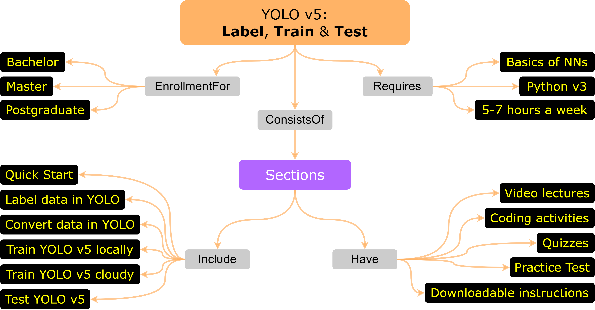

# Traffic Signs dataset in YOLO v5 format
> **YOLO v5 format** of the traffic signs dataset to train and test detector.  
> **Trained weights** can be found inside the course mentioned below.  

### Explore the dataset used for training & testing 👇
[https://www.kaggle.com/datasets/valentynsichkar/yolo-v5-format-of-the-traffic-signs-dataset](https://www.kaggle.com/datasets/valentynsichkar/yolo-v5-format-of-the-traffic-signs-dataset)

`The main 4 categories of the traffic signs are as following:`

prohibitory  | danger | mandatory | other
------------- | ------------- | ------------- | -------------
speed limit | priority at next intersection | go right | restriction ends
no overtaking | danger | go left | priority road
no traffic both ways | bend left | go straight | give way
no trucks | bend right | go right or straight | stop
 | bend | go left or straight | no entry
 | uneven road | keep right |
 | slippery road | keep left |
 | road narrows | roundabout |
 | construction |
 | traffic signal 
 | pedestrian crossing |
 | school crossing |
 | cycles crossing |
 | snow |
 | animals |

 

 

### 🎓 YOLO v5: Label, Train and Test. Join the course! 👇
[https://www.udemy.com/course/yolo-v5-label-train-and-test](https://www.udemy.com/course/yolo-v5-label-train-and-test/?referralCode=2171545772F09930296E)

> **Have a look at the abilities that you will obtain:**  
> 📢 `Run` YOLO v5 to detect objects on image, video and in real time by camera in the first lectures.  
> 📢 `Label-Create-Convert` own dataset in YOLO format.  
> 📢 `Train & Test` both: in your `local machine` and in the `cloud machine` (with custom data and by few lines of the code).  

 

### Concept map of the YOLO v5 course 👇

 

### Join the course! 👇
[https://www.udemy.com/course/yolo-v5-label-train-and-test](https://www.udemy.com/course/yolo-v5-label-train-and-test/?referralCode=2171545772F09930296E)

 

### MIT License
### Copyright (c) 2024 Valentyn N Sichkar
### github.com/sichkar-valentyn
### Reference to:
Valentyn N Sichkar. Traffic Signs dataset in YOLO v5 format // GitHub platform
